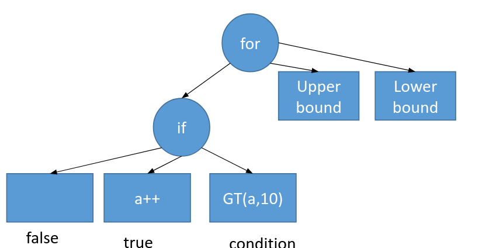

Code generation in Sympiler starts from an input specification. The input specification is then internally converted to an abstract syntax tree (AST). Each node of the AST represents a method, and edges represent dependency between methods. Each method (or a node of AST) is described with a set of statements and expressions. 
Sympiler applies a set of transformations to the AST and finally generates C++ code corresponding to the AST.  


Here we use the triangular solve example to explain the input specification, AST, two transformations of the Sympiler's lowering pipeline applied to the AST, and the final generated code. 


## Input specification
The input code to Sympiler specifies one sparse method and their input matrix and vectors. 
The input specification for the sparse triangular solve with a sparse right-hand side is shown below:

```C++
    ...
    Sparse l(Float(64),matname);
    Sparse rhs(Float(64),rhsname);
    Triangular trns(l,rhs);
    trns.sympile_to_c(outname);
    ...
```

As shown above, the code specifies the lower triangular matrix `l` and right-hand side vector `rhs` as well as 
the method type, i.e., `Triangular`. 
Three strings `matname`, `rhsname`, and `outname` show the path for the input matrix and right-hand side and the path of the generated output C++ code. These values are provided as command-line arguments. For example, you can call the following from the build directory:

```bash
sympile ../sympiler/code_gen/data/cbuckle.mtx ../sympile/code_gen/cbuckle_rhs.mtx ../sympiler/code_gen/symGen/cbuck 
```

The above input specification is provided in the driver code in [here](https://github.com/sympiler/sympiler/blob/master/code_gen/src/sympiler.cpp). 


## AST generation
The AST is internally generated from the input specification. For the input specification discussed [here](), the AST has only one node, i.e. triangular solve. Each node of AST is described with expressions and statements. 
Let's assume the simple code below is an AST node. 
```C++
for(int i = 0; i<10; i++){
    if(a>10){
        a++
    }
}

```

Sympiler describes this simple code with expressions and statements as shown visually in the below graph:

<figure markdown>
  { width=470 }
  <figcaption>Sympiler AST for describing a loop with a conditional in its body. </figcaption>
</figure>


A similar procedure is used to describe the sparse triangular solve (CSC) as shown in [here](https://github.com/sympiler/sympiler/blob/6a333cd4745eef51da039725509ac04e24fb5819/code_gen/src/Triangular.cpp#L56). The equivalent C++ code of the sparse triangular solve is shown below:
```C++
x=b; // copy RHS to x
for(j=0;j<n;j++){
    x[j]/=Lx[Lp[j]];
    for(p=Lp[j]+1;p<Lp[j+1];p++){
        x[Li[p]]-=Lx[p]*x[j];
    }
}
```


## Lowering pipeline
The lowering pipeline takes an AST and a symbolic object as inputs and transforms the code by applying a group of transformations (as shown in [here](https://github.com/sympiler/sympiler/blob/6a333cd4745eef51da039725509ac04e24fb5819/code_gen/src/Triangular.cpp#L251)). The decision of applying a transformation is made based on the information of the symbolic object. The lowering pipeline is shown in [here](https://github.com/sympiler/sympiler/blob/master/code_gen/src/Lower.cpp) and has currently two stages. As a result of applying each stage, a new AST is created. The final AST is returned to be used by the code generation module. 


## C++ code

Finally, the C++ code corresponding to the final AST is generated by calling `compile_to_source_c` as shown in [here](https://github.com/sympiler/sympiler/blob/6a333cd4745eef51da039725509ac04e24fb5819/code_gen/src/Triangular.cpp#L255). 
The code generation iterates over each expression and statement and prints an equivalent C++ code for the specified architecture (i.e., only x86 is supported). 
An example of generated code for the traingular solve is shown [here](https://github.com/sympiler/sympiler/blob/6a333cd4745eef51da039725509ac04e24fb5819/code_gen/symGen/cbuckle_trns_gen.h#L122). 


## Limitations

The current code generation has definitions of sparse triangular solve and Cholesky. Other methods can be added but would require defining their AST internally. Two transformations, iteration pruning, and block tiling are inside the code generation part. The loop fusion transformation is not public and the aggregation tiling is not integrated into the code generation part. However, it can be used as a library as described [here](sympiler-lib.md).