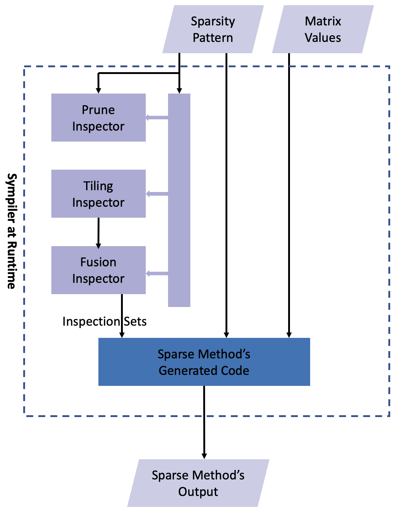

Sympiler is a domain-specific code generator and library that optimizes sparse matrix computations by decoupling the symbolic analysis phase from the numerical manipulation stage in sparse codes. Symbolic analysis refers to extracting information from nonzero locations in a sparse matrix. Sympiler includes a set of compile-time and runtime techniques. This section gives an overview of Sympiler. 

## Why Sympiler?
Sympiler addresses the challenge of irregular and indirect memory accesses in sparse computation through efficient use of compile-time and runtime information. Since compile-time analysis in these codes misses several optimizations, Sympiler organizes runtime information. Particularly, when the sparsity pattern remains static for some time, these techniques become  profitable.  

## Sympiler Internals 
Sympiler takes an input specification and generates an efficient parallel code using a set of compile-time transformations and also runtime inspection. We provide an overview of input/output and the Sympiler internals. 

### Input and Output
The input code to Sympiler specifies one or a set of sparse methods and their input matrix and vectors. 
Code implementing a sparse method is represented in a domain-specific abstract syntax tree (AST). Sympiler produces an efficient code for the method by applying a series of lowering phases to the AST. The generated code and a set of inspectors are used to perform the sparse method on a given matrix. 

### Compile-time inspector-guided transformations
The compile-time flow in Sympiler is shown in the figure below, 
where a series of inspector-guided transformations are 
applied to the initial AST inside Sympiler. Each of these 
transformation, when applied, would require runtime 
information (obtained through runtime inspectors). 
Enabling these transformations is either directed by the user or 
chosen based on the input sparsity pattern of the matrix at runtime. 
So When the sparsity pattern is not used at compile time, 
the final generated code is independent of the input. 

<figure markdown>
   
  <figcaption>Sympiler Compile-time: three inspector-guided transformations are applied to the input method to generate a parallel code for the method.</figcaption>
</figure>

### Runtime symbolic inspectors 
Runtime inspectors in Sympiler process location of nonzeros in a 
sparse matrix to extract information to run the generated code efficiently. 
The extracted information is called symbolic information, and 
the inspectors are called symbolic inspectors. 
For each class of numerical algorithms with the same symbolic 
analysis approach, Sympiler uses a specific symbolic inspector 
to obtain information about the sparsity structure of the input matrix and stores it in an algorithm-specific way for use during executing the generated code (obtained at compile-time from here).
We classify the used symbolic inspectors based on the numerical
method, as well as the transformations enabled by the obtained
information. For each combination of algorithm and transformation,
the symbolic inspector creates an inspection graph from the given
sparsity pattern and traverses it during the inspection using a specific
inspection strategy. The result of the inspection is the inspection set,
which contains the result of running the inspector on the inspection
graph. Inspection sets and symbolic information can be used to switch between code variants at runtime. Additional numerical algorithms and transformations
can be added to Sympiler, as long as the required inspectors can be
described in this manner as well.

<figure markdown>
  { width=470 }
  <figcaption>Sympiler Runtime: the sparsity pattern of the input matrix is processed by three symbolic inspectors to create inspection sets. Each inspector is associated with an inspector-guided transformation. The generated code uses the sets to perform the sparse operation efficiently and in parallel. </figcaption>
</figure>

The current transformations proposed and prototyped in Sympiler are [Iteration-space Prunning](prune.md), [Loop Tiling](tiling.md), [Loop Fusion](fusion.md), and [Vectorization](vect.md).

